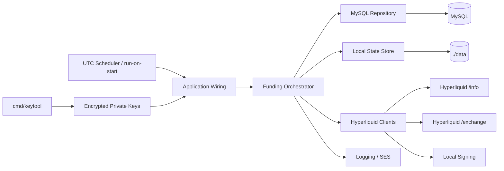
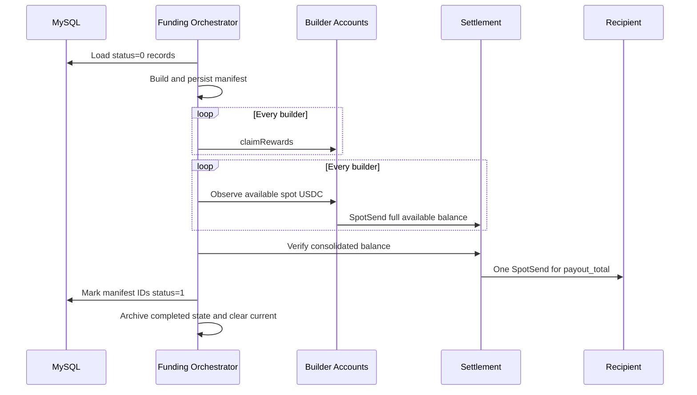

# 架构说明

本文描述 Hyperliquid Builder Code Bot 当前实现的系统边界、组件关系、资金状态机和
安全不变量。部署、配置和故障处置参见 [运维指南](operations.md)。

## 1. 系统目标

服务每天在 UTC 00:00 执行一次资金结算，也可以通过 `--run-on-start` 在启动恢复完成
后立即执行一轮。每轮任务完成以下工作：

1. 从 MySQL 读取所有 `status = 0` 的返佣资金记录。
2. 对所有 builder 账户领取奖励。
3. 将每个 builder 的全部可用 spot USDC 归集到独立 settlement 账户。
4. 由 settlement 向固定 recipient 发起一次 spot USDC 付款。
5. 将本轮 manifest 中的数据库记录更新为 `status = 1`。

服务以单机、单实例方式运行。它不创建额外业务表，而是使用固定的 `./data` 目录保存
可恢复状态，并通过进程锁、MySQL named lock、不可变 manifest 和链上证据避免重复付款。

## 2. 系统边界

### 2.1 范围内

- 多个 builder EOA 的奖励领取与 USDC 全额归集。
- 独立 settlement EOA 的单笔最终付款。
- MySQL pending records 的读取和完成标记。
- Hyperliquid L1 action 与 SpotSend EIP-712 签名。
- 加密私钥、启动密码输入和敏感信息脱敏。
- 本地原子状态、崩溃恢复和结果不明确时的链上核对。
- UTC 调度、结构化日志和 AWS SES 告警。

### 2.2 范围外

- 多实例或跨机器的高可用调度。
- 自动轮换私钥、自动轮换解密密码或密文格式版本迁移。
- 修改返佣金额、重新计算结算周期或选择特定日期的数据。
- 自动处置损坏且无有效备份的本地状态。
- 为本服务新增数据库业务表。

## 3. 组件关系



主要包职责如下：

| 路径 | 职责 |
| --- | --- |
| `cmd/builder-code-bot` | 参数解析、信号处理和服务入口 |
| `cmd/keytool` | 私钥加密、地址校验和受控解密 |
| `internal/app` | 配置、账户、客户端、日志和调度的依赖装配 |
| `internal/config` | TOML 严格解码与跨字段校验 |
| `internal/funding` | manifest、资金状态机、结果核对和崩溃恢复 |
| `internal/hyperliquid` | HTTP、Info、Exchange、签名与 wire 编码 |
| `internal/repository/mysql` | 数据查询、完成更新、named lock 和长期重试 |
| `internal/state` | 原子快照、备份、归档、校验和与进程锁 |
| `internal/notification` | SES 通知、告警窗口和 MySQL outage observer |
| `internal/logging` | 结构化日志和敏感字段过滤 |
| `internal/scheduler` | 下一 UTC 零点计算和可取消定时器 |
| `internal/dev/hyperliquidmock` | 本地协议 mock 与端到端恢复测试 |

## 4. 账户模型

系统包含三类账户：

- **Builder accounts**：一个或多个配置账户。每轮先领取奖励，再把全部可用 spot USDC
  转到 settlement。
- **Settlement account**：独立账户，不得与任何 builder 相同。它汇总 builder 资金并
  发起最终付款。
- **Recipient**：固定收款地址，不得与 settlement 相同，不需要私钥。

所有 builder 与 settlement 私钥使用同一个解密密码，但每个配置地址都必须与私钥
派生地址一致。服务不会把私钥、解密密码、签名或完整签名请求写入日志、通知或本地
状态。

## 5. 源数据与金额规则

数据来源固定为：

```sql
SELECT id, period_start_at, amount, status, created_at
FROM trasia_points_rebate_funding_record
WHERE status = 0;
```

`period_start_at` 只用于 manifest 排序和审计，不用于筛选“昨天”的记录。尚未完成的
历史周期会与其他 pending records 一起进入下一轮。

金额处理遵守以下不变量：

1. `amount` 按 `DECIMAL(65,18)` 文本解析，不经过二进制浮点数。
2. 先精确汇总全部记录，再对总额执行一次六位小数向上取整。
3. 计算公式为 `ceil(raw_total × 10^6) / 10^6`。
4. 任意负数使本轮停止，不更新数据库，也不形成已完成状态。
5. 无 pending records 或总额为零时，不发起链上付款。

例如原始总额 `1.000000000000000001` 的最终付款额为 `1.000001`。

## 6. 不可变 manifest

新任务在任何链上变更前生成 manifest。manifest 包含：

- 排序后的数据库记录及其原始金额；
- 原始精确总额和六位向上取整后的付款额；
- 动态解析的 canonical USDC 元数据；
- builder 地址列表、settlement 地址和 recipient 地址；
- 规范 JSON 内容的 SHA-256 hash。

记录按 `period_start_at, id` 排序。任务恢复时重新验证 envelope checksum、manifest hash
和记录顺序，不允许用新的数据库查询结果替换当前 manifest。manifest 创建后新增的
pending records 留给后续任务。

数据库完成阶段只更新 manifest 中的 ID：

```sql
UPDATE trasia_points_rebate_funding_record
SET status = 1
WHERE id IN (...);
```

更新使用参数化、分批事务，并在提交结果不明确时复核记录状态。

## 7. 资金处理流程



### 7.1 Claim 与余额可见性

所有 builder claim 先执行，随后才开始任何归集。Hyperliquid 接受 claim 与 Info API
显示新余额并非原子事件。对已接受或结果不明确但可能已执行的 claim，服务以签名请求
的 action time 为基准，等待至一秒可见时间后只查询一次实际余额。明确 rejected 或尚未
提交的 claim 不等待，直接查询现有余额。多个 builder 共享已经流逝的等待时间。

查询结果为零会保存为 `zero_balance`。该状态不是永久终态：任务恢复或 blocked 任务
重试时会重新查询，以便归集后来可见的余额。单个 builder claim 失败只触发状态记录和
告警，不阻碍其他 builder；只要 settlement 已有足够余额，最终 payout 仍可完成。

### 7.2 Builder 全额归集

每个 builder 使用 `total - hold` 计算可用 spot USDC，并把完整可用余额转到
settlement。任一请求在提交前都先保存 prepared action；提交结果、余额快照和可用链上
证据在变更后再次持久化。

### 7.3 最终付款

只有所有 builder claim 阶段结束、归集阶段完成且 settlement 可用余额不低于
`payout_total` 时，settlement 才创建最终 SpotSend。最终付款始终只有一个逻辑请求，
不会按数据库记录逐笔付款。

余额不足时任务进入 `blocked`，保留 current state 和告警；后续恢复会重新检查余额，
不会支付部分金额。

## 8. Hyperliquid 集成

### 8.1 Network 与 API 地址

代码内置：

- Mainnet：`https://api.hyperliquid.xyz`
- Testnet：`https://api.hyperliquid-testnet.xyz`

`hyperliquid.network` 决定签名域和默认 API 地址。非空 `base_url` 只覆盖 HTTP target，
不会改变签名网络，主要用于本地 mock。

### 8.2 Token 解析

服务通过 spot metadata 动态解析唯一的 canonical USDC，并使用
`NAME:tokenId` 作为 SpotSend wire token，不硬编码生产 token ID。可用余额为
`total - hold`。

### 8.3 签名

- `claimRewards` 使用 Hyperliquid L1 action signing。
- SpotSend 使用 `HyperliquidTransaction:SpotSend` typed data。
- SpotSend domain 为 `HyperliquidSignTransaction`、version `1`、chain ID `0x66eee`，
  verifying contract 为零地址。
- SpotSend action 的 `time` 与 exchange request 的 `nonce` 相同。

HTTP target 被 mock URL 覆盖时，签名仍使用配置的 Mainnet 或 Testnet label。

## 9. Exact request 与结果核对

每个外部变更遵循同一提交协议：

1. 生成 nonce、action、signature 和完整 JSON request body。
2. 计算 request body 的 SHA-256。
3. 在发送前持久化 exact request body 和 hash。
4. 直接发送持久化字节，不重新 marshal 或重新签名。
5. 保存接受、拒绝或不明确结果，以及脱敏后的响应和证据。

崩溃恢复只能重放同一个 exact request，不能生成新的 nonce。重放次数有上限；证据不足
时 fail closed，任务保持 blocked。

### 9.1 SpotSend 不明确结果

Hyperliquid 的 `WsSpotTransfer` delta 不包含请求 nonce。因此服务不把单条 ledger 记录
当作独立确认，而是联合以下证据：

- 发送方提交前后的余额差额；
- action time 附近现实时间窗内的 ledger update；
- sender、destination、token 和 decimal amount 全部精确匹配；
- 时间窗内只有一条满足条件的记录。

存在零条或多条匹配、余额差不符、API 查询失败或金额无法解析时均不确认付款。查询
时间窗允许 action time 前少量时钟偏差，并延伸到当前时间之后的安全边界。

### 9.2 Claim 不明确结果

Claim 没有等价的 spot-transfer ledger 证据。来自 stale backup 且无法确认是否已提交的
claim 会标记为 `unconfirmable`，不会再次发送；服务仍可观察并归集 builder 当前余额，
避免 claim 不确定性阻塞已有 USDC。

## 10. 状态机

任务级 phase：

| Phase | 含义 |
| --- | --- |
| `prepared` | manifest 已生成并持久化 |
| `consolidating` | 正在 claim 或归集 builder 余额 |
| `funded` | 归集结束，正在检查 settlement 余额 |
| `payout_submitting` | 最终付款 exact request 已持久化，正在提交或核对 |
| `payout_accepted` | 最终付款已确认 |
| `db_updating` | 只允许完成数据库，不再创建付款 |
| `completed` | 数据库完成，等待归档和清理 |
| `blocked` | 余额不足、证据不明确或需要人工处理 |

单个 action phase 包括 `prepared`、`submitting`、`accepted`、`rejected`、`unknown` 和
`zero_balance`。`submitting` 与 `unknown` 在恢复时必须先核对结果，再决定是否重放。

## 11. 本地持久化与锁

状态目录固定为 `./data`：

```text
data/
├── LOCK
├── current.json
├── current.json.bak
└── history/
```

- 目录权限为 `0700`，状态和锁文件为 `0600`。
- envelope 包含 schema version、RunState 和 RunState JSON 的 SHA-256 checksum。
- 保存顺序为同目录临时文件、`fsync`、current 移为 backup、临时文件移为 current、目录
  `fsync`。
- primary 损坏时可以回退到有效 backup，并记录告警。
- primary 与 backup 都损坏时停止自动执行，不覆盖现有证据。
- completed state 先归档，归档成功后才清理 current 与 backup。

进程启动时通过 Unix non-blocking `flock` 获取本地进程锁，并在 App 整个生命周期内
持有，以保证同一服务器和工作目录中只有一个 bot 实例运行。生产服务必须使用固定的
工作目录，确保所有启动方式都指向同一个 `./data/LOCK`。

Backup 可能比损坏的 primary 落后一个持久化边界。来自 backup 的未完成 action 会被
视为潜在 ambiguous，并计入可能已经发生的一次提交，避免扩大重放预算。

## 12. MySQL 一致性与重试

MySQL 层使用长期复用的 `database/sql` 连接池。瞬时错误采用响应 context cancel 的
有界退避并持续重试，覆盖计划维护的数分钟不可用窗口。可重试错误包括连接中断、
server shutdown、deadlock 和 lock wait timeout。

认证失败、数据库或表不存在、列错误、SQL 错误、数据扫描错误和业务校验错误不会
无限重试。它们会保留当前状态并触发告警。

最终付款确认后，状态进入 `db_updating`。即使数据库此时不可用，恢复也只会重新执行
幂等数据库完成逻辑，不会创建第二个付款请求。

## 13. 调度与启动顺序

启动顺序固定为：

1. 解析和严格校验配置。
2. 获取 `./data/LOCK`。
3. 从配置读取共享密码，或在真实 TTY 中无回显读取一次。
4. 解密并验证全部 builder 与 settlement 私钥地址。
5. 初始化日志、SES、MySQL、Hyperliquid clients 和 orchestrator。
6. 如果存在 current state，先执行恢复。
7. 如果显式提供 `--run-on-start`，再执行一轮新任务；否则等待下一 UTC 00:00。
8. 每轮结束后重新计算下一 UTC 零点。

`--run-on-start` 是 flag presence 语义，不会使常驻服务在执行一轮后退出。SIGINT 和
SIGTERM 会取消 scheduler 和进行中的可取消等待，然后按顺序关闭数据库与进程锁。

## 14. 私钥与配置安全

私钥密文为原始 Base64 编码的 `salt || nonce || ciphertext`：

- KDF：scrypt，`N=32768`、`r=8`、`p=1`；
- cipher：AES-256-GCM；
- 所有账户共用一个解密密码；
- 算法或参数变化时重新生成密文，不维护密文版本迁移。

`signing.decrypt_password` 非空时直接使用配置值；为空时必须从真实终端读取，服务不从
环境变量读取该密码。派生 key、明文私钥字节和临时密码缓冲区在使用后清零。

配置使用 TOML 严格解码，未知字段、重复或冲突账户、地址与私钥不匹配、无效 network
及不完整 SES 配置都会阻止启动。

## 15. 日志与通知

日志支持 console 或 JSON、动态 level、可选颜色和 source。敏感属性会在 handler 层
过滤，业务日志只记录 run ID、phase、action kind、attempt 和脱敏错误类别。

SES 告警覆盖：

- 负数或非法源数据；
- builder claim、余额查询或归集失败；
- settlement 余额不足；
- 链上结果无法确认；
- 状态损坏或 backup fallback；
- MySQL 长时间不可用、恢复及数据库完成失败。

Dispatcher 使用并发安全的 active-to-resolve 窗口去重。多个 MySQL operation 同时重试
时，只有最后一个 operation 恢复才发送全局恢复通知。通知失败不会改变资金状态。

## 16. 核心安全不变量

1. 一个 manifest 只对应一个逻辑最终付款。
2. 链上请求发送前必须持久化 exact request body。
3. 恢复不能为已有 action 生成新的 nonce。
4. 证据不明确时不得假定成功或创建替代付款。
5. 最终付款确认后只能进入数据库完成流程。
6. 数据库只完成 manifest 中的记录 ID。
7. 任意负数都不能付款或标记完成。
8. Builder claim 全部结束后才开始归集。
9. 可能已执行的 claim 必须经过一秒可见时间后再查询实际余额。
10. 本地状态与日志中不得出现私钥或解密密码。
11. 无有效 current/backup 证据时不得强制启动新任务覆盖现场。

## 17. 验证边界

项目测试覆盖以下架构边界：

- Hyperliquid ordered msgpack、L1 和 SpotSend 签名恢复；
- canonical USDC、余额、无 nonce ledger 与 decimal string/number 解码；
- 金额极值、六位向上取整和 manifest hash；
- 原子状态、backup fallback、锁和损坏检测；
- 每个链上变更前后的保存 failpoint 与跨进程等价恢复；
- claim 一秒可见时间、单次余额查询和 rejected claim 不阻碍已注资 payout；
- rejected、ambiguous、HTTP applied/unapplied 和 ledger delay；
- MySQL 数分钟 outage、commit ambiguity 和 named lock 重获；
- UTC 调度、TTY 密码输入、SES 并发去重和敏感信息扫描。

本地 Hyperliquid mock 使用真实 HTTP client、签名、状态文件和恢复流程，但它不替代
主网或测试网协议变更的持续核对。

## 18. 外部协议参考

- [Builder codes](https://hyperliquid.gitbook.io/hyperliquid-docs/trading/builder-codes)
- [Exchange endpoint](https://hyperliquid.gitbook.io/hyperliquid-docs/for-developers/api/exchange-endpoint)
- [Signing](https://hyperliquid.gitbook.io/hyperliquid-docs/for-developers/api/signing)
- [Nonces and API wallets](https://hyperliquid.gitbook.io/hyperliquid-docs/for-developers/api/nonces-and-api-wallets)
- [WebSocket subscriptions and ledger types](https://hyperliquid.gitbook.io/hyperliquid-docs/for-developers/api/websocket/subscriptions)
